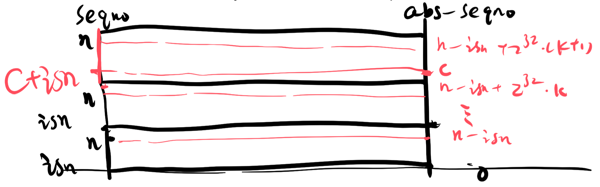
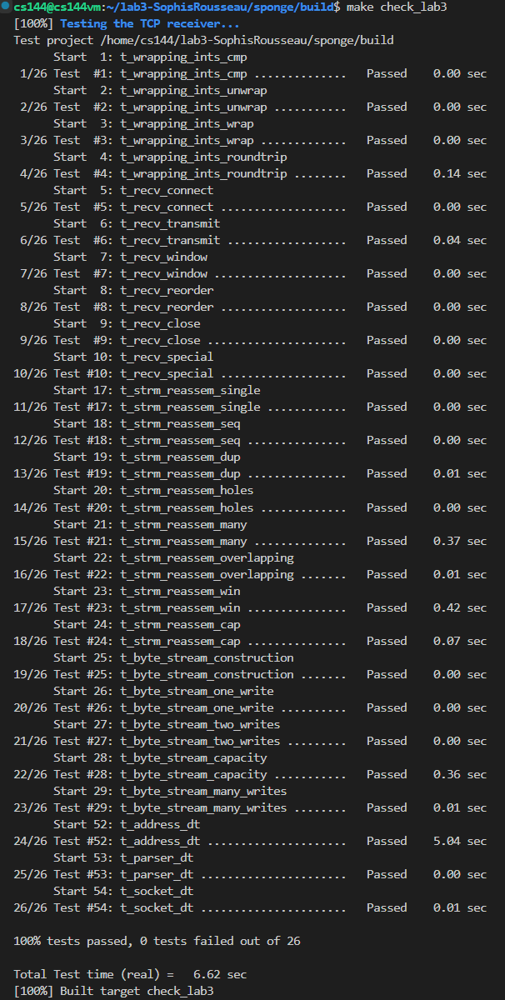

Lab 3 Writeup
=============

My name: Zuo, Qikun

My Student number : 201830013

This lab took me about 3 hours to do. I did attend the lab session.

#### 1. Program Structure and Design:

In wrapping_integers.cc, we write wrap() and unwrap() to implement the conversion between sequence numbers and absolute sequence numbers. The relationship between sequence numbers and absolute sequence numbers is: abs_seqno + isn (mod 1 << 32) = seqno. So the implementation of the function wrap() is easy: just add abs_seqno and isn together according to the operator overloaded in the class WrappingInt32. Note that a seqno n corresponds to many absolute seqnos, and we need to find the absolute seqno that is closest to the checkpoint. Thus to implement function unwrap(), we could first find the seqno of the checkpoint, i.e., checkpoint + isn (mod 1 << 32). And then we need to discuss the quantitative relationship between n and the seqno of the checkpoint to determine the distance between the absolute seqno of n and checkpoint. Several different cases and edge conditions should be taken into consideration in order to make the result strict.

In tcp_receiver.cc, we write segment_received() to: (1)listen to 'syn' to record the beginning of a stream, the ISN of the stream (i.e., seg.header().seqno), and the FIN signal; (2)calculate the checkpoint, the absolute seqno, and the stream index of the stream; (3)use the function  push_substring() of the reassembler to reassemble the byte stream. Writing function akcno() and window_size() is easy: just use the right member functions of the class Bytestream. And the ISN and FIN signal should also be taken into consideration when calculating the acknowledgment number (ackno).

#### 2. Implementation Challenges:

The hardest part of the lab is to unwrap the seqno, i.e., to convert the seqno into the absolute seqno according to the given checkpoint. Several different cases and edge conditions should be taken into consideration in order to make the result strict. We drew a picture of the mapping relationship between the absolute seqnos and seqnos to make the conversion algorithm clear and comprehensible.

#### 3. Remaining Bugs:

Until now, no bugs are found in the code submitted.