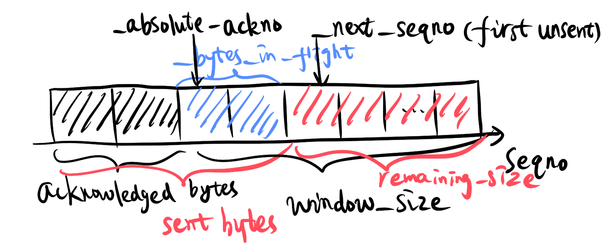
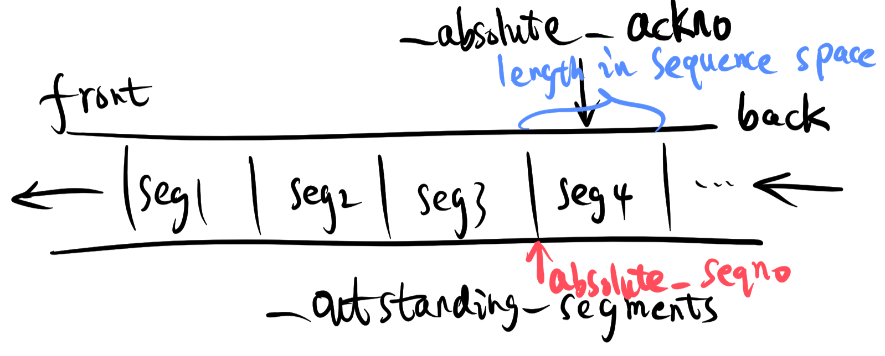
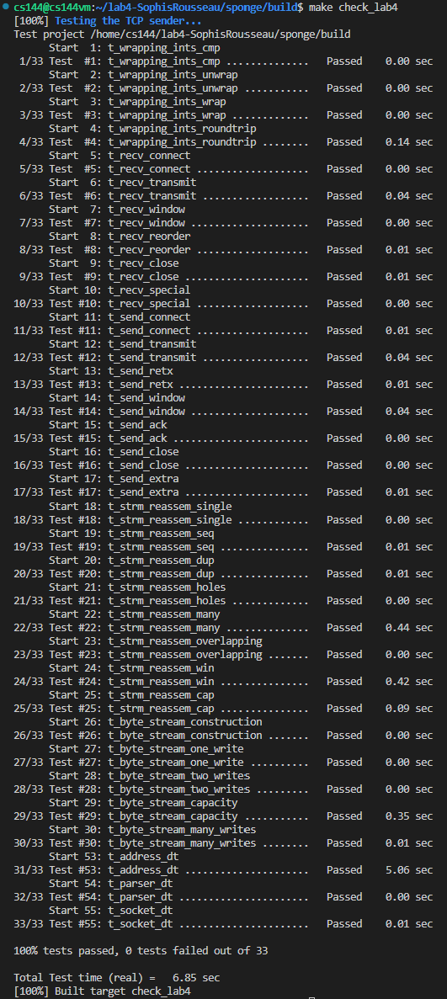

Lab 4 Writeup
=============

My name: Zuo, Qikun

My SUNet ID: 201830013

This lab took me about 8 hours to do. I did attend the lab session.

I worked with or talked about this assignment with: Nobody

Program Structure and Design of the TCPSender:

First, we add a new class RetransmissionTimer to tcp_sender.hh serving as the timer for TCPSender. The meaning of each member variable and the role of each member function in the class have been marked in the following code.
```C++
class RetransmissionTimer {
  private:
    size_t _ticks{0}; // total elapsed time

    bool _is_started{false}; // is the timer started or not

  public:
    bool is_expired(const size_t ms_since_last_tick, const unsigned retransmission_timeout) {
        return _is_started && (_ticks += ms_since_last_tick) >= retransmission_timeout;
    } // decide whether the retransmission timer expires or not

    bool is_started() { return _is_started; } // is the timer started or not

    void stop() { _is_started = false; } // stop the timer (when all outstanding data has been acknowledged)

    void start() { // start the timer
        _is_started = true;
        _ticks = 0;  
    }
}; 
```
Second, we add some member variables to the class TCPSender. The meaning of each member variable added to the class has been marked in the following code.
```C++
size_t _remaining_size{0}; // remaining space for sending new bytes to the receiver

std::queue<TCPSegment> _outstanding_segments{}; // segments which are not acknowledged, stored in a queue

uint64_t _absolute_ackno{0}; // latest (largest) ackno received from the receiver

size_t _window_size{1}; // latest window size received from the receiver

RetransmissionTimer _retransmission_timer{}; // retransmission timer

unsigned int _retransmission_timeout; // current retransmission timeout (RTO)

size_t _consecutive_retransmissions{0}; // the number of consecutive retransmissions

bool _finish_sending{false}; // finish sending or not
```

Third, we focused our major attention on implementing the fill_window() and ack_received() in tcp_sender.cc. 

a. In fill_window(), the TCP sender should write all of the fields of the TCPSegment that were relevant to the TCPReceiver, namely, (1) the SYN flag, (2) the sequence number, (3) the payload, (4) the FIN flag. All of these 4 steps, as well as sending the segments (pushing into _segments_out), storing the outstanding segments in a queue data structure _outstanding_segments, and the update of member variables (_retransmission_timer, _next_seqno, _bytes_in_flight, etc.), are reflected in the code shown below, which is fully commented. And the following figure shows the quantitative relationship between the member variables.
```C++
void TCPSender::fill_window() {
    if(_finish_sending) {
        return;
    }

    _remaining_size = (_window_size ? _window_size : 1) - (next_seqno_absolute() - _absolute_ackno); // remaining space for sending new bytes to the receiver
    // have the sending space and not get to sending ending

    while (_remaining_size > 0 && !_finish_sending) {
               TCPSegment segment = TCPSegment();

        if (next_seqno_absolute() == 0) { // (1) handling SYN 
            segment.header().syn = true;
            _remaining_size--; // syn occupies space in the window
        }

        segment.header().seqno = next_seqno(); // (2) handling sequence number (seqno)
        
        segment.payload() = stream_in().read(min(_remaining_size, TCPConfig::MAX_PAYLOAD_SIZE)); // (3) handling payload // use min(_remaining_size, MSS)
        
        _remaining_size -= segment.payload().size();

        if (stream_in().eof() && _remaining_size > 0) { // (4) handling FIN
            segment.header().fin = true;
            _finish_sending = true;
            _remaining_size--; // fin occupies space in the window
        }

        if (segment.length_in_sequence_space() == 0) { // segment.length_in_sequence_space() == length of the segment 
            return;
        }

        segments_out().push(segment); // send segment
        _outstanding_segments.push(segment); // store outstanding segment
        if (!_retransmission_timer.is_started()) { // Every time a segment containing data (nonzero length in sequence space) is sent (whether it’s the first time or a retransmission), if the timer is not running, start it running so that it will expire after RTO milliseconds (for the current value of RTO).
            _retransmission_timer.start();
        }

        // update members in class TCPSender
        _next_seqno += segment.length_in_sequence_space(); // bytes sent to the receiver increases by segment.length_in_sequence_space()
        _bytes_in_flight += segment.length_in_sequence_space(); // outstanding bytes increase by segment.length_in_sequence_space()
    }
}
```


b.In ack_received(), the TCP sender only reads the fields in the segment that are written by the receiver: (1) the ackno and (2) the window size. After getting the window size, the function will use it to update _window_size; After getting the ackno, the function will use it to decide whether each of the outstanding segments stored in _outstanding_segments should be popped out or not. And if the receiver acknowledges the successful receipt of new data, the TCP sender should: (a) Set the RTO back to its “initial value.” (b) If the sender has any outstanding data, restart the retransmission timer so that it will expire after RTO milliseconds (for the current value of RTO). (c) Reset the count of “consecutive retransmissions” back to zero. The code shown below is fully commented, and the following figure shows the checking process of _outstanding_segments.
```C++
void TCPSender::ack_received(const WrappingInt32 ackno, const uint16_t window_size) {
    _absolute_ackno = unwrap(ackno, _isn, next_seqno_absolute()); // (1) read the ackno
    _window_size = window_size; // (2) read the window size (and update _window_size)

    bool flag = false;
    while (_outstanding_segments.size() > 0) {
        TCPSegment segment = _outstanding_segments.front();
        uint64_t absolute_seqno = unwrap(segment.header().seqno, _isn, next_seqno_absolute()); 
        if (absolute_seqno + segment.length_in_sequence_space() > _absolute_ackno) { // the segment is not fully acknowledged by the receiver
            break; // so do the segments following the segment
        }
        _outstanding_segments.pop(); // fully acknowledged segment
        _bytes_in_flight -= segment.length_in_sequence_space(); // outstanding bytes decrease by segment.length_in_sequence_space()
        flag = true; // the receiver acknowledges the successful receipt of new data
    }

    if (flag) { // acknowledges the successful receipt of new data
        _retransmission_timeout = _initial_retransmission_timeout; // Set the RTO back to its “initial value.
        if (_outstanding_segments.size() > 0) { // If the sender has any outstanding data, restart the retransmission timer so that it will expire after RTO milliseconds (for the current value of RTO).
            _retransmission_timer.start();
        } else { // When all outstanding data has been acknowledged, stop the retransmission timer.
            _retransmission_timer.stop();
        }
        _consecutive_retransmissions = 0; // Reset the count of “consecutive retransmissions” back to zero.
    }
}
```


Implementation Challenges:
In practice, I found that the biggest difficulty in implementation is to sort out the quantitative relationship between the various member variables, as shown in Figure 1. Especially, the update of _remaining_size is quite critical. With just a little bit of misconception (for example, not taking into account that the SYN and FIN flags also take up space), some test cases will fail. Also, it is also important to read the tutorial extremely carefully before implementing these functions, as the tutorial shows some critical steps and details. Therefore, if ignoring these steps and details, it is difficult to pass all test cases.

Remaining Bugs:



Until now, no new bugs are found in the code commited.