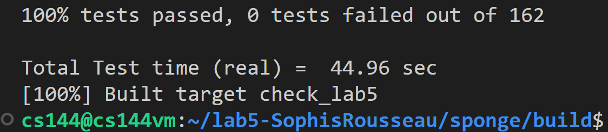

Lab 5 Writeup
=============

My name: Zuo, Qikun

My Student number : 201830013

This lab took me about 2 days to do. I did attend the lab session.

#### 1. Program Structure and Design:

In the TCP connection, we probably have to do 5 main things: receiving segments, sending segments, ending the connection if necessary, requesting connection, and ending input stream.

(1) Receive segments, which is implemented in the function `segment_received()`. According to the tutorial, we need to do five things in the function:
<1> if the rst (reset) flag is set, sets both the inbound and outbound streams to the error state and kills the connection permanently, i.e., does a unclean shutdown. 
```C++
// <1> if rst flag is set
if (header.rst) {
    shutdown(false);  // unclean shutdown
    return;
}
```
<2> gives the segment to the TCPReceiver so it can inspect the fields it cares about on incoming segments: seqno, syn, payload, and fin, i.e., call function `_receiver.segment_received()`.
```C++
// <2> give the segment to the receiver (seqno, syn , payload, and fin)
_receiver.segment_received(seg);
```
<3> if the ack flag is set, tells the TCPSender about the fields it cares about on incoming segments: ackno and window size, i.e., call function `_sender.ack_received()`. 
``` C++
// <3> if ack flag is set (ackno and window size)
if (header.ack) {
    _sender.ack_received(header.ackno, header.win);
}
```
<4> if the incoming segment occupied any sequence numbers, the TCPConnection makes sure that at least one segment is sent in reply, to reflect an update in the ackno and window size.
```C++
// <4> if the incoming segment occupied any sequence numbers, the
// TCPConnection makes sure that at least one segment is sent in reply
// (i.e., _sender.segments_out.size() > 0), to reflect an update in the ackno and
// window size
if (seg.length_in_sequence_space() > 0 &&
    _sender.segments_out().size() == 0) {
    _sender.fill_window();
    // if nothing can be sent, then send an empty segment
    if (_sender.segments_out().size() == 0) {
        _sender.send_empty_segment();
    }
}
```
<5> responding to a "keep-alive" segment.
```C++
// <5> responding to a "keep-alive" segment
if (_receiver.ackno().has_value() &&
    (seg.length_in_sequence_space() == 0) &&
    (header.seqno == _receiver.ackno().value() - 1)) {
    _sender.send_empty_segment();
}
```
Additionally, the TCPConnection will send TCPSegments over the Internet any time the TCPSender has pushed a segment onto its outgoing queue. So we need to call `send_segments()`.
```C++
send_segments();
```
Last, we need to reset the variable `_time_since_last_segment_received` to `0` and check whether the variable `_linger_after_streams_finish` should be set to `false`. It starts out true. If the inbound stream ends before the TCPConnection has reached EOF on its outbound stream, this variable needs to be set to false.
```C
_time_since_last_segment_received =
    0;  // elapsed time since last segment received
if (_receiver.stream_out().eof() &&
    !_sender.stream_in().eof()) {
    _linger_after_streams_finish = false;
}
```

(2) Send segments, which is implemented in the function `send_segments()`. We need to check all the segmetns in the sender's sending queue. Before sending the segment, i.e., pushing the segments into `_segments_out`, the TCPConnection will ask the TCPReceiver for the fields it's responsible for on outgoing segments: ackno and window size. If there is an ackno, it will set the ack flag and the fields in the TCPSegment.
```C++
void TCPConnection::send_segments() {
    while (_sender.segments_out().size() > 0) {
        TCPSegment& segment = _sender.segments_out().front();
        TCPHeader& header = segment.header();
        // header.win is of type uint16_t, while receiver's window size is
        // uint32_t
        //  Before sending the segment, the TCPConnection will ask the
        //  TCPReceiver for the fields it's responsible for on outgoing
        //  segments: ackno and window size. If there is an ackno, it will set
        //  the ack flag and the fields in the TCPSegment.
        header.win = min(size_t(numeric_limits<uint16_t>::max()),
                         _receiver.window_size()); // set window size
        if (_receiver.ackno().has_value()) {
            header.ack = true;
            header.ackno = _receiver.ackno().value(); // set ackno
        }
        _segments_out.push(segment); // send a segment
        _sender.segments_out().pop();
    }
}
```

(3) End the connection if necessary, which is implemented in the function `tick()`. We need to:
<1> abort the connection, and send a reset segment to the peer (an empty segment with the rst flag set), if the number of consecutive retransmissions is more than an upper limit TCPConfig::MAX RETX ATTEMPTS.
```C++
// <1> abort the connection, and send a reset segment to the peer (an empty
// segment with the rst flag set), if the number of consecutive
// retransmissions is more than an upper limit TCPConfig::MAX RETX ATTEMPTS
if (_sender.consecutive_retransmissions() >= _cfg.MAX_RETX_ATTEMPTS) {
    send_rst_segment();
    shutdown(false); // unclean shutdown
    return;
}
```
<2> tell the TCPSender about the passage of time.
``` C++
_sender.tick(ms_since_last_tick);
send_segments();  // because some segment may need to be retransmitted
```
<3> end the connection cleanly if 4 prerequisites are satisfied.
```C++
// <3>  end the connection cleanly if necessary
if (_receiver.stream_out().eof() &&  // Prereq # 1
    _sender.stream_in().input_ended() &&     // Prereq # 2
    (_sender.bytes_in_flight() ==
        0)) {  // Prereq # 3, i.e., all the bytes are received by the remote peer
    // At any point where prerequisites #1 through #3 are satisfied, the
    // connection is “done” (and active() should return false) if linger
    // after streams finish is false. Otherwise you need to linger: the
    // connection is only done after enough time (10 × cfg.rt timeout)
    // has elapsed since the last segment was received
    // Prereq # 4
    if (!_linger_after_streams_finish ||  // Option B: passive close
        _time_since_last_segment_received >= 10 * _cfg.rt_timeout) { // Option A: lingering after both streams end
        shutdown(true); // clean shutdown
    }
}
```

(4) request connection.
```C++
void TCPConnection::connect() {
    _sender.fill_window();  // send syn
    send_segments();
}
```

(5) end input stream.
```C++
void TCPConnection::end_input_stream() {
    _sender.stream_in().end_input();
    _sender.fill_window();  // send fin if necessary
    send_segments();
}
```
#### 2. Implementation Challenges:

Obviously, this lab is the most difficult of all labs, which takes me 2 days to debug and finally pass all the test cases, because this time we are standing on the top level of TCP to look at the data transmission between two peers, and we need to take all possible situations into account. In addition, the test cases in the previous labs cannot fully check out the bugs in the implementation of the sender or receiver. So this time we not only need to debug in TCPconnection, but also need to debug in TCPsender and TCPreceiver, which makes this lab extremely difficult and troublesome. However, since the tutorial is written in detail: it explains in detail what should be done in TCP connection and the steps of each thing, as shown in the first part of the writeup, which to a certain extent makes the process of writing code more orderly and clear, and reduces the difficulty of debugging.

#### 3. Remaining Bugs:



Until now, no bugs are found in the code submitted.