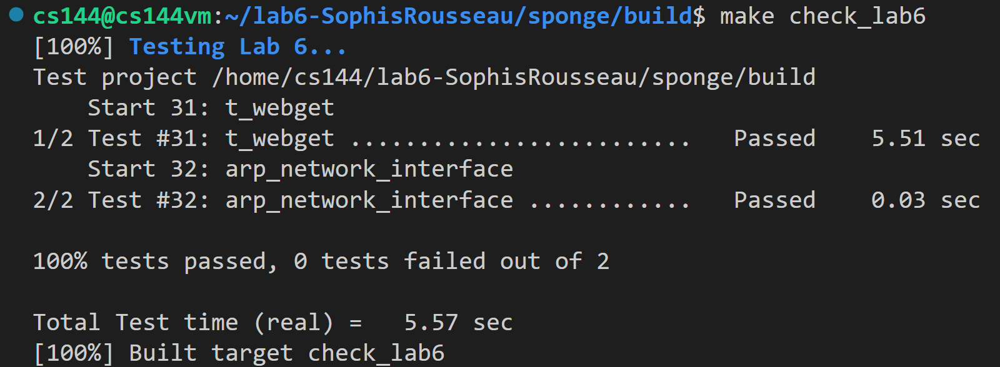

Lab 6 Writeup
=============

My name: Zuo, Qikun

My Student number : 201830013

This lab took me about 4 hours to do. I did attend the lab session.

#### 1. Program Structure and Design:

##### (1) New Data Structure and Member Variables
```C++
// entry of the ARP table
struct ARPEntry {
    EthernetAddress ethernet_address;
    size_t ttl;
};
// TTL and datagrams corresponding to an ARP request waiting for an ARP reply
struct WaitingArpRequestsEntry {
    size_t ttl{}; // TTL of the ARP request. After TTL, a new ARP reqest should be sent.
    std::vector<std::pair<InternetDatagram, Address>> pending_datagrams{}; // datagrams correspoing to the ARP request
};
// ARP table; Key value is an IP address
std::map<uint32_t, ARPEntry> _arp_table{};
// TTL of an ARP entry (30s)
const size_t _arp_entry_ttl = 30000;
// mapping from an IP address to TTL and datagrams corresponding to an ARP request waiting for an ARP reply of the IP address; Key value is an IP address of which we do not know its Ethernet address 
std::map<uint32_t, WaitingArpRequestsEntry> _waiting_arp_requests{};
// TTL of an ARP request (5s)
const size_t _arp_request_ttl = 5000;
```

##### (2) Implementation of Functions in newwork_interface.cc

##### a. void NetworkInterface::send_datagram()

Following the tutorial, we need to do the following things in this function:

• If the destination Ethernet address is already known, i.e., the ARP table has the mapping from the IP address to its Ethernet address, send it right away. Create an Ethernet frame (with `type` = `EthernetHeader::TYPE_IPv4`, `dst` = the Ethernet address of the destination IP, `src` = `_ethernet_address`), set the payload to be the serialized datagram.

• If the destination Ethernet address is unknown, and no ARP requests has been sent yet (i.e., `_waiting_arp_requests` does not have the entry), then add a new entry to `_waiting_arp_requests`, and broadcast an ARP request for the next hop’s Ethernet address; Otherwise, nothing will be done, since an ARP request about the same IP address has been sent in the last five seconds. Then queue the IP datagram into the corresponding entry in `_waiting_arp_requests`, so it can be sent after the ARP reply is received.

The code below is commented in detail.

```C++
void NetworkInterface::send_datagram(const InternetDatagram& dgram,
                                     const Address& next_hop) {
    // convert an IP address that comes in the form of an Address object, into a
    // raw 32-bit integer
    const uint32_t next_hop_ip = next_hop.ipv4_numeric();
    // map from IP addresses to Ethernet addresses
    const auto& iter = _arp_table.find(next_hop_ip);
    // If the destination Ethernet address is unknown, broadcast an ARP request
    // for the next hop’s Ethernet address, and queue the IP datagram so it can
    // be sent after the ARP reply is received
    if (iter == _arp_table.end()) {
        // if there was no arp request corresponding to the ip
        if (_waiting_arp_requests.find(next_hop_ip) ==
            _waiting_arp_requests.end()) {
            // send a arp request
            ARPMessage arp_request;
            arp_request.opcode = ARPMessage::OPCODE_REQUEST;
            arp_request.sender_ip_address = _ip_address.ipv4_numeric();
            arp_request.sender_ethernet_address = _ethernet_address;
            arp_request.target_ip_address = next_hop_ip;
            arp_request.target_ethernet_address = {};
            // send a ethernet frame packaging the arp request
            EthernetFrame ethernet_frame;
            ethernet_frame.header().dst = ETHERNET_BROADCAST;
            ethernet_frame.header().src = _ethernet_address;
            ethernet_frame.header().type = EthernetHeader::TYPE_ARP;
            ethernet_frame.payload() = arp_request.serialize();
            _frames_out.push(ethernet_frame);

            _waiting_arp_requests[next_hop_ip].ttl = _arp_request_ttl;
        }
        // one ip may correspond to many datagrams
        _waiting_arp_requests[next_hop_ip].pending_datagrams.push_back(
            make_pair(dgram, next_hop));
    } else {
        // send a ethernet frame packaging the datagram
        EthernetFrame ethernet_frame;
        ethernet_frame.header().dst = iter->second.ethernet_address;
        ethernet_frame.header().src = _ethernet_address;
        ethernet_frame.header().type = EthernetHeader::TYPE_IPv4;
        ethernet_frame.payload() = dgram.serialize();
        _frames_out.push(ethernet_frame);
    }
}
```


##### b. optional<InternetDatagram> NetworkInterface::recv_frame()

Following the tutorial, we need to do the following things in this function:

• The code should ignore any frames not destined for the network interface (meaning, the Ethernet destination is either the broadcast address or the interface’s own Ethernet address
stored in the ethernet address member variable).

• If the inbound frame is IPv4, parse the payload as an InternetDatagram and, if successful (meaning the parse() method returned ParseResult::NoError), return the resulting InternetDatagram to the caller.

• If the inbound frame is a valid ARP (its destination IP address should be `_ip_address`, and if it is a ARP reply, its destination Ethernet address should be `_ethernet_address`), parse the payload as an ARPMessage and, if successful, remember the mapping between the sender’s IP address and Ethernet address for 30 seconds. (Learn mappings from both requests and replies.) Since we have received an IP address and its Ethernet address from the ARP message (whether it is a request or a reply), we should check `_waiting_arp_requests` to see whether there is an key value equal to the IP address. If so, we can directly use the Ethernet address in the ARP message to send datagrams that have not been sent yet, and then erase the entry from the table. In addition, if it’s an ARP request asking for our IP address, send an appropriate ARP reply.

The code below is commented in detail.
```C++
optional<InternetDatagram> NetworkInterface::recv_frame(
    const EthernetFrame& frame) {
    // The code should ignore any frames not destined for the network interface
    // (meaning, the Ethernet destination is either the broadcast address or the
    // interface’s own Ethernet address stored in the _ethernet_address member
    // variable)
    if (!(frame.header().dst == _ethernet_address ||
          frame.header().dst == ETHERNET_BROADCAST)) {
        return {};
    }
    // If the inbound frame is IPv4, parse the payload as an InternetDatagram
    // and, if successful (meaning the parse() method returned
    // ParseResult::NoError), return the resulting InternetDatagram to the
    // caller
    if (frame.header().type == EthernetHeader::TYPE_IPv4) {
        InternetDatagram datagram;
        if (datagram.parse(frame.payload()) == ParseResult::NoError) {
            return datagram;
        }
    }
    //  If the inbound frame is ARP
    else if (frame.header().type == EthernetHeader::TYPE_ARP) {
        ARPMessage arp_message;

        // parse the payload as an ARPMessage
        if (arp_message.parse(frame.payload()) != ParseResult::NoError) {
            return {};
        }
        //  A valid ARP message remember the mapping between the sender’s IP
        //  address and Ethernet address for 30 seconds. (Learn mappings from
        //  both requests and replies.)
        if (arp_message.target_ip_address == _ip_address.ipv4_numeric() &&
            (arp_message.opcode == ARPMessage::OPCODE_REQUEST ||
             (arp_message.opcode == ARPMessage::OPCODE_REPLY &&
              arp_message.target_ethernet_address == _ethernet_address))) {
            _arp_table[arp_message.sender_ip_address] = {
                arp_message.sender_ethernet_address, _arp_entry_ttl};
            // send datagrams waiting for the ethernet address
            const auto& iter = _waiting_arp_requests.find(
                arp_message.sender_ip_address);
            if (iter != _waiting_arp_requests.end()) {
                for (auto& each : iter->second.pending_datagrams) {
                    send_datagram(each.first, each.second);
                }
                _waiting_arp_requests.erase(
                    arp_message.sender_ip_address);
            }

            // In addition, if it’s an ARP request asking for our IP
            // address, send an appropriate ARP reply
            if (arp_message.opcode == ARPMessage::OPCODE_REQUEST) {
                // send a arp reply
                ARPMessage arp_reply;
                arp_reply.opcode = ARPMessage::OPCODE_REPLY;
                arp_reply.sender_ip_address = _ip_address.ipv4_numeric();
                arp_reply.sender_ethernet_address = _ethernet_address;
                arp_reply.target_ip_address = arp_message.sender_ip_address;
                arp_reply.target_ethernet_address =
                    arp_message.sender_ethernet_address;
                // send a ethernet frame packaging the arp reply
                EthernetFrame ethernet_frame;
                ethernet_frame.header().dst =
                    arp_message.sender_ethernet_address;
                ethernet_frame.header().src = _ethernet_address;
                ethernet_frame.header().type = EthernetHeader::TYPE_ARP;
                ethernet_frame.payload() = arp_reply.serialize();
                _frames_out.push(ethernet_frame);
            }
        }
    }

    return {};
}
```

##### c. void NetworkInterface::tick()

In this method, we need to check the two tables `_arp_table` and `_waiting_arp_requests` after `ms_since_last_tick` time elapsed. 

While traversing the table `_arp_table`, if an ARP entry times out, we need to erase it from the table; Otherwise, we only need to subtract `ms_since_last_tick` from its TTL. 

While traversing the table `_waiting_arp_requests`, if an ARP request times out, we need to reset its TTL, and resend an ARP request; Otherwise, we only need to subtract `ms_since_last_tick` from its TTL.

```C++
void NetworkInterface::tick(const size_t ms_since_last_tick) {
    // check _arp_table
    for (auto iter = _arp_table.begin(); iter != _arp_table.end();) {
        // if the mapping times out
        if (iter->second.ttl <= ms_since_last_tick)
            iter = _arp_table.erase(iter);
        else {
            iter->second.ttl -= ms_since_last_tick;
            ++iter;
        }
    }
    // check _waiting_arp_requests
    for (auto iter = _waiting_arp_requests.begin();
         iter != _waiting_arp_requests.end(); ++iter) {
        // if the arp request times out
        if (iter->second.ttl <= ms_since_last_tick) {
            // resend a arp request
            ARPMessage arp_request;
            arp_request.opcode = ARPMessage::OPCODE_REQUEST;
            arp_request.sender_ethernet_address = _ethernet_address;
            arp_request.sender_ip_address = _ip_address.ipv4_numeric();
            arp_request.target_ethernet_address = {};
            arp_request.target_ip_address = iter->first;
            // resend a ethernet frame packaging the arp request
            EthernetFrame ethernet_frame;
            ethernet_frame.header().dst = ETHERNET_BROADCAST;
            ethernet_frame.header().src = _ethernet_address;
            ethernet_frame.header().type = EthernetHeader::TYPE_ARP;
            ethernet_frame.payload() = arp_request.serialize();
            _frames_out.push(ethernet_frame);

            iter->second.ttl = _arp_request_ttl;
        } else {
            iter->second.ttl -= ms_since_last_tick;
        }
    }
}
```

#### 2. Implementation Challenges:

In this lab, it is probably a little difficult to think about how to manage the datagrams that are temporarily stored because the Ethernet address is unknown. It should be noted that a destination IP address (corresponding to an ARP request) may have multiple datagrams that have not been sent yet. To solve the problem, the data structure we choose in this lab is `map`. When given a destination IP address, it can be mapped into a structure, which stores the TTL of the ARP request corresponding to the destination IP address and the datagrams belonging to the destination IP address (stored in a vector). In this way, we can process the unsent datagrams and TTL of ARP requests in the above three functions uniformly and conveniently.

#### 3. Remaining Bugs:

Until now, no bugs are found in the code submitted.


