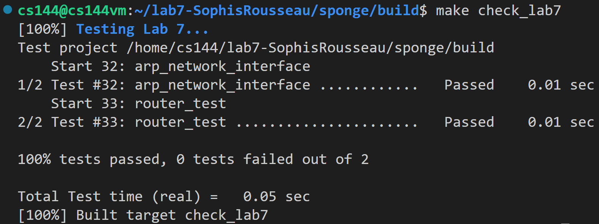

Lab 7 Writeup
=============

My name: Zuo, Qikun

My Student number : 201830013

This lab took me about 1 hours to do. I did attend the lab session.

#### 1. Program Structure and Design:

##### (1) New Data Structure and Member Variables
```C++
// entry of the routing table
struct RouteEntry {
        const uint32_t route_prefix;
        const uint8_t prefix_length;
        const std::optional<Address> next_hop;
        const size_t interface_num;
    };
// routing table
std::vector<RouteEntry> _routing_table{};
```

##### (2) Implementation of Functions in router.cc

##### a. void Router::add_route()
In this function, we only need to add a new entry to the routing table. The arguments can be directly used to initialize the members of the new entry.
```C++
void Router::add_route(const uint32_t route_prefix,
                       const uint8_t prefix_length,
                       const optional<Address> next_hop,
                       const size_t interface_num) {
    cerr << "DEBUG: adding route "
         << Address::from_ipv4_numeric(route_prefix).ip() << "/"
         << int(prefix_length) << " => "
         << (next_hop.has_value() ? next_hop->ip() : "(direct)")
         << " on interface " << interface_num << "\n";
    // Your code here.
    _routing_table.push_back(
        RouteEntry{route_prefix, prefix_length, next_hop, interface_num});
}
```

##### b. void Router::route_one_datagram()
According to the tutorial, this method needs to route one datagram to the next hop, out the appropriate interface. It needs to implement the “longest-prefix match” logic of an IP router to find the best route to follow:

• The Router searches the routing table to find the routes that match the datagram’s destination address. Among the matching routes, the router chooses the route with the biggest value of prefix length. This is the longest-prefix-match route. In the code, while traversing the routing table, we use `longest_prefix` to keep track of the biggest value of `prefix_length` and `interface_num` to keep track of the appropriate interface corresponding to `longest_prefix`. 

• If no routes matched, or if the TTL was zero already, or hits zero after the decrement, the router should drop the datagram.

• Otherwise, the router sends the modified datagram on the appropriate interface
(interface(interface num).send datagram()) to the appropriate next hop. If the router is directly attached to the network in question, the next hop will be an empty optional. In this case, the next hop is the datagram’s destination address, i.e., the code sending the datagram to the next hop should be written as `interface(interface_num).send_datagram(dgram,Address::from_ipv4_numeric(dgram.header().dst));`; But if the router is connected to the network in question through some other router, the next hop will contain the IP address of the next router along the path. In this case, the code sending the datagram to the next hop should be written as `interface(interface_num).send_datagram(dgram, _routing_table[interface_num].next_hop.value());`
```C++
void Router::route_one_datagram(InternetDatagram& dgram) {
    int interface_num = -1;
    size_t longest_prefix = 0;
    // The Router searches the routing table to find the routes that match the
    // datagram’s destination address. Among the matching routes, the router
    // chooses the route with the biggest value of prefix length. This is the
    // longest-prefix-match route.
    for (size_t i = 0; i < _routing_table.size(); ++i) {
        if (_routing_table[i].prefix_length >= longest_prefix) {
            // calculate the subnet mask
            uint32_t mask =
                _routing_table[i].prefix_length == 0
                    ? 0
                    : (0xFFFFFFFF << (32 - _routing_table[i].prefix_length));
            // By “match,” we mean the most-significant prefix length bits of
            // the destination address are identical to the most-significant
            // prefix length bits of the route prefix.
            if ((dgram.header().dst & mask) ==
                (_routing_table[i].route_prefix & mask)) {
                // update longest_prefix and interface_num
                longest_prefix = _routing_table[i].prefix_length;
                interface_num = _routing_table[i].interface_num;
            }
        }
    }
    // If no routes matched, the router drops the datagram.
    // The routerdecrements the datagram’s TTL (time to live). If the TTL was
    // zero already,or hits zero after the decrement, the router should drop the
    // datagram.
    if (!(interface_num == -1 || dgram.header().ttl-- <= 1)) {
        // If the router is directly attached to the network in question, the
        // next hop will be an empty optional. In that case, the next hop is the
        // datagram’s destination address. But if the router is connected to the
        // network in question through some other router, the next hop will
        // contain the IP address of the next router along the path.
        if (_routing_table[interface_num].next_hop.has_value()) {
            interface(interface_num)
                .send_datagram(dgram,
                               _routing_table[interface_num].next_hop.value());
        } else {
            interface(interface_num)
                .send_datagram(dgram,
                               Address::from_ipv4_numeric(dgram.header().dst));
        }
    }
}
```

#### 2. Implementation Challenges:

This lab is relatively simple, thus no significant challenges were met during the implementation.

#### 3. Remaining Bugs:

Until Now, No bugs are found in the code submitted.

